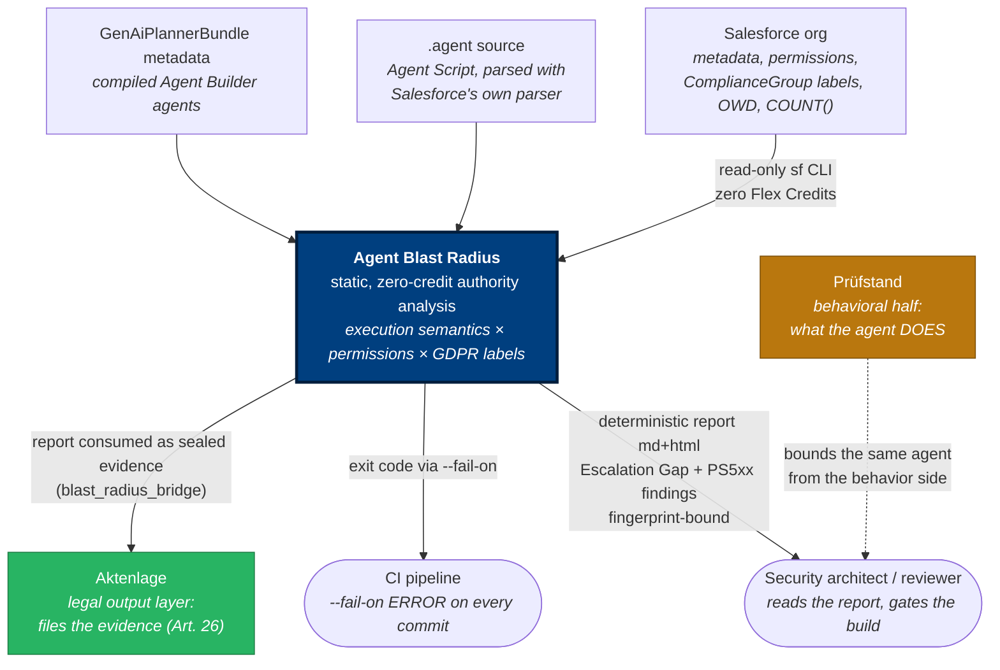

# 01 — System Context (C4 Level 1)

## Purpose

Where Agent Blast Radius sits: what it reads, who consumes its output, and
which boundaries it never crosses (no agent invocation, no data egress).

## Diagram

## Key observations

1. **The agent is never invoked** (ADR-009): every arrow into the tool is
   metadata, source, or zero-credit SOQL. No Flex Credits, no triggered
   behaviour, no data leaving the machine.
2. **Two agent input paths, one analysis**: Agent Script source (with the
   data→prompt taint proof, PS520–522) and compiled GenAi metadata converge
   on the same IR (ADR-010, ADR-004).
3. **The question is user-scoped**: not "what can this org's code do" but
   "what can THIS agent reach as THIS running user" — reach × effective
   permissions × the org's own GDPR labels. The composition is the novelty.
4. **Downstream, the report is evidence**: Aktenlage seals it by hash and
   renders the legal case file; the fingerprint (ADR-007) is what makes that
   hand-off auditable.

## Drill-down

Inside the tool: [02 — Container Diagram](02-container.md).
