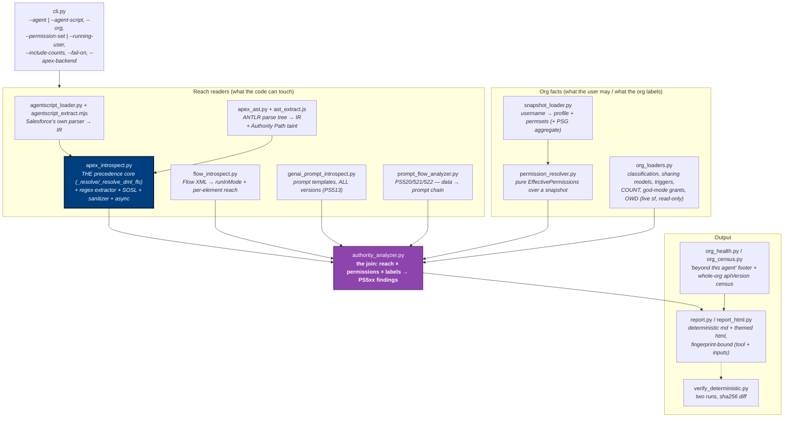

# 02 — Container Diagram (C4 Level 2)

## Purpose

The module pipeline: reach readers on the left, org facts on the right, the
authority join in the middle. The load-bearing rule is that **both Apex
extraction backends feed the SAME precedence core** (ADR-004) — a reach
feature added to one path only creates a backend-specific blind spot.

## Diagram

## Layer rules

| Component | May | Must never | Why |
|---|---|---|---|
| Extraction backends (regex / AST) | emit IR | apply their own precedence interpretation | one law, one place (ADR-004) |
| `apex_introspect` core | resolve mode per the law | be "fixed" from documentation | ADR-001: experiments only |
| `permission_resolver` | pure computation over a snapshot | live queries | testability; snapshots are fixtures |
| `org_loaders` | read-only live SOQL | any write; any agent invocation | ADR-009 |
| `authority_analyzer` | join + emit findings | fabricate a number or estimate visibility | ADR-003/008; the rule table IS this file |
| `report*` | render + fingerprint | be trusted over the console summary | reports are written after render — check the console line |

## The benchmark sits outside the pipeline

`benchmark/` (corpus, runner, mutation, runtime oracle, sfge differential)
consumes the analyzer as a black box — labels are hand-written, never
generated from the law under test (ADR-005), and the oracle's ground truth
is the org itself.

## Drill-down

- One scan in time order: [03 — Sequence](03-sequence.md)
- What flows between the stages: [04 — Data Model](04-data-model.md)
