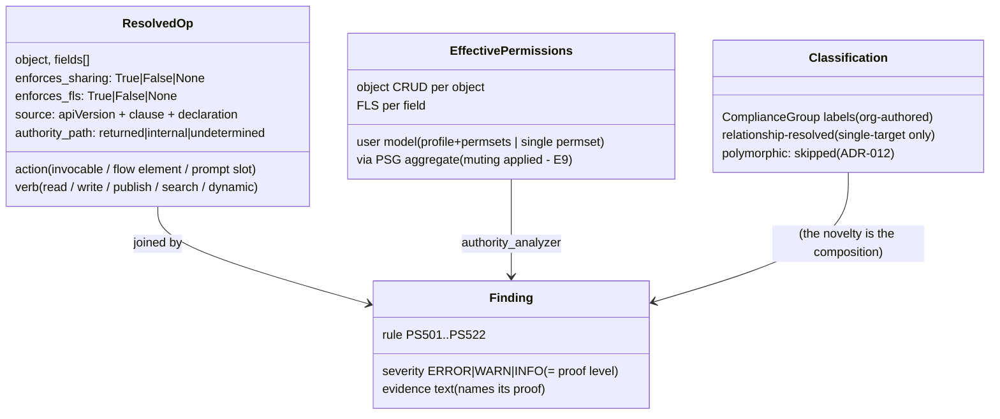

# 04 — Data Model: what flows between the stages

## Purpose

The shapes that matter: the resolved operation (the tool's atom), the three
inputs to the authority join, and the finding. Also the invariants that
bind them — including the one that broke once and is now test-locked.

## The atom: a resolved operation

## The two axes (never merge them)

| axis | means | set by |
|---|---|---|
| `enforces_sharing` | record-level visibility | sharing keyword (under system mode), or user mode |
| `enforces_fls` | object CRUD **and** field-level security | apiVersion default / explicit clause |

"Bounded by the running user" requires **both** True. `None` = undetermined
(a declaration-less class inherits its caller — E2/E10) and is reported,
never coerced (ADR-002).

## Null / absence semantics

| State | Meaning | Consequence |
|---|---|---|
| `enforces_* = None` | genuinely undetermined | reported as such; severity worst-cases where the axis is severity-relevant |
| Dynamic SOQL / SOSL without RETURNING | reach unknown | **PS504** — the honest unknown; fires even when the object is unknown |
| Async/event/callout hand-off | followed where modelled (queueable/batch/@future/EventBus.publish as a write); Flow/process/external subscriber NOT followed | **PS514** names precisely which edge is open |
| Sharing-dependent record visibility | data-dependent | `n/a` — never estimated (ADR-008) |
| Field behind polymorphic lookup | unclassifiable statically | stays unclassified; PS506 blind there by decision (ADR-012) |

## Invariants

- **Concentric circles**: `outer == inner + gap` — the escalation gap is
  exactly the fields the code reaches beyond the user. This broke once
  (relationship fields wrongly re-prefixed by `_qualify()`); the fix and a
  test guard it. Relationship paths stay verbatim (`BillToContact.Email`),
  only direct fields get prefixed.
- **Spelling is semantics**: `classification()` takes fields as `_qualify`
  spells them; `_rel_root` accepts both qualified and unqualified spellings
  because one caller's spelling once silently disabled relationship
  resolution — a false clean with no bug anywhere else.
- **The fingerprint binds per-action apiVersion** — same class text at a
  different version is a different verdict (ADR-007).

## Where the rule semantics live

The full PS501–PS522 table with severities and firing conditions is
`CLAUDE.md` §5 (kept there, next to the discipline that governs changes to
it). This file describes the data; that file describes the law.
