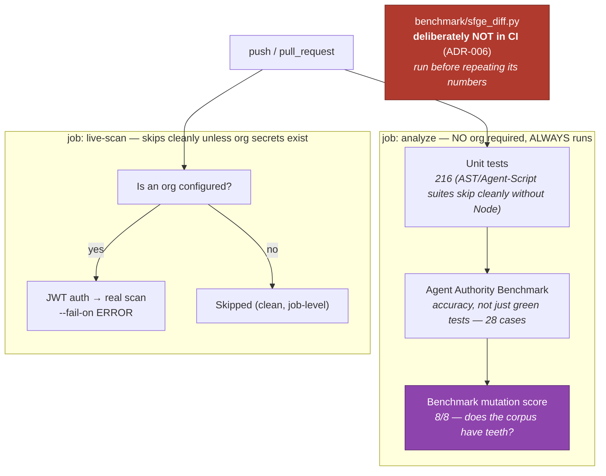

# 05 — CI: what gates, what skips, what deliberately stays out

## Purpose

The CI design encodes three different contracts, and confusing them is how
pipelines rot: prove the analyzer (always), demonstrate a live scan (when an
org exists), and re-measure a comparative claim (never per-commit).

## Diagram

## The three contracts

| Contract | Where | Trigger | Red means |
|---|---|---|---|
| The analyzer is correct | `analyze` job | every push | this commit broke the analyzer (tests, accuracy, or corpus teeth) |
| A real scan still works end-to-end | `live-scan` job | push, IF org secrets configured | integration drift (auth, retrieve, org shape) |
| The comparative claim vs sfge holds | `sfge_diff.py`, manual | before citing the numbers | **this tool** contradicts the org (it exits 0 on sfge-only disagreements) |

## Why the differential stays out (short form of ADR-006)

Not speed (measured: 42s). The gate proves the *analyzer*; the differential
proves a *comparative claim* that does not change per commit. Gating it puts
a third-party Java engine in the critical path and goes red when *sfge*
changes. The obligation it leaves behind is explicit: **re-run it before
repeating its numbers** — if sfge fixes its apiVersion blindness, the 7/19
headline goes stale and nothing else would tell us.

## Relationship to the sibling repo's CI

Aktenlage mirrors the same philosophy one layer up: its gates prove the
legal-layer checks (tests, mutation 11/11, strict, determinism) and its
org-touching bridges stay out of CI for the same reason the oracle and the
differential stay out here — a gate must fail only for the thing it gates.
